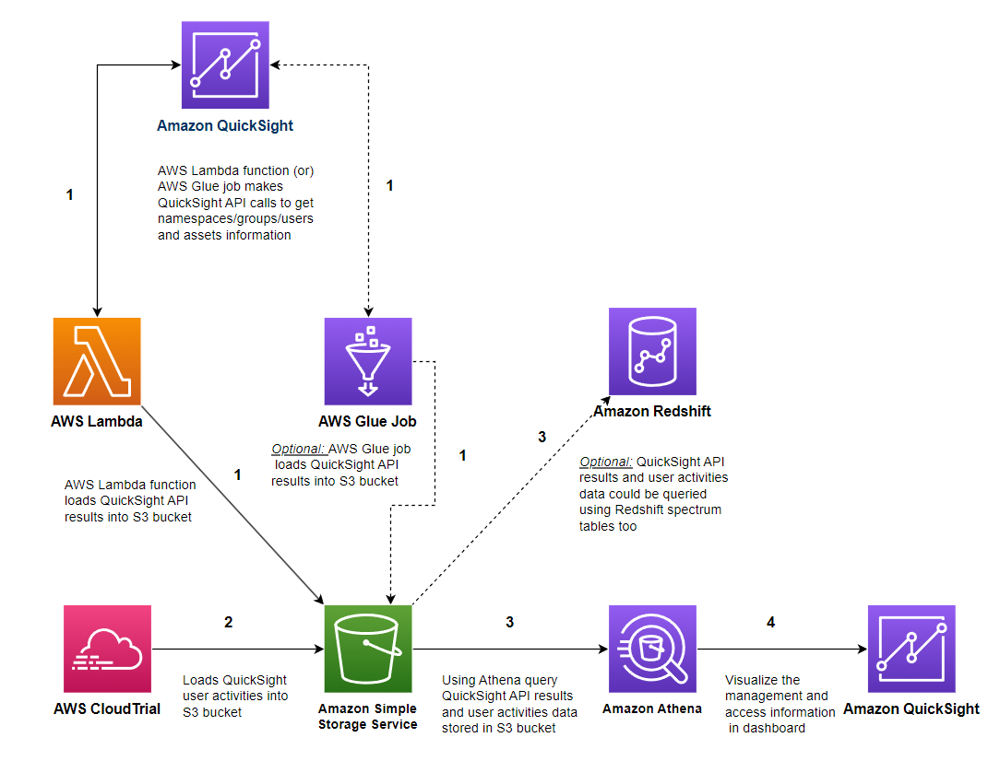

# QuickSight Admin Dashboard - Terraform Implementation

This project provides a Terraform implementation of the Amazon QuickSight Admin Dashboard described in the AWS blog article [Measure the adoption of your Amazon QuickSight dashboards and view your BI portfolio in a single pane of glass](https://aws.amazon.com/blogs/business-intelligence/measure-the-adoption-of-your-amazon-quicksight-dashboards-and-view-your-bi-portfolio-in-a-single-pane-of-glass/) by Maitri Brahmbhatt, Balaji Selva Rajan, Ian Liao, Marcelo Coronel, and Ying Wang.

## Overview

This solution creates a comprehensive admin dashboard for Amazon QuickSight that provides visibility into:

- Dashboard usage metrics
- User activity
- Group memberships
- Dataset information
- Overall QuickSight adoption

The original solution was implemented using CloudFormation templates. This project converts those templates to Terraform resources for easier deployment and management.

## Architecture

The solution consists of the following components:

1. **Lambda Functions** - Process QuickSight data and store it in S3
2. **Athena Tables** - Query the processed data
3. **QuickSight Dashboard** - Visualize the data



## Prerequisites

- AWS account with appropriate permissions
- Terraform v1.0.0 or later
- CloudTrail enabled and logging to an S3 bucket
- QuickSight Enterprise subscription

## Usage

1. Clone this repository
2. Update the `terraform.tfvars` file with your specific values
3. Initialize Terraform:
   ```
   terraform init
   ```
4. Plan the deployment:
   ```
   terraform plan -out=tfplan
   ```
5. Apply the configuration:
   ```
   terraform apply tfplan
   ```

## Configuration

Create a `terraform.tfvars` file with the following variables:

```hcl
region              = "us-east-1"
cloudtrail_location = "your-cloudtrail-bucket/AWSLogs/your-account-id/CloudTrail"
start_date          = "2023/01/01"
quicksight_admin_arn = "arn:aws:quicksight:us-east-1:your-account-id:user/default/admin-username"
```

## Customization

You can customize the solution by modifying the following files:

- `variables.tf` - Adjust default values or add new variables
- `lambda.tf` - Modify Lambda function configurations
- `athena.tf` - Customize Athena table schemas
- `quicksight.tf` - Adjust QuickSight resources

## Lambda Functions

The solution includes two Lambda functions:

1. **Data Preparation Function** - Collects QuickSight metadata and stores it in S3
2. **Dataset Information Function** - Processes dataset information

The Lambda function code is stored in the `lambda` directory and deployed to S3 during the Terraform apply process.

## Contributing

Contributions are welcome! Please feel free to submit a Pull Request.

## License

This project is licensed under the MIT License - see the LICENSE file for details.

## Acknowledgments

- Original AWS blog authors: Maitri Brahmbhatt, Balaji Selva Rajan, Ian Liao, Marcelo Coronel, and Ying Wang
- AWS CloudFormation templates from the original blog post